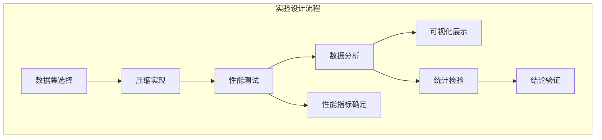

# 执行摘要

本文从信息论和实现机制两大角度深度分析了高性能压缩算法（Zstandard、Oodle系列、LZ4等）的核心原理与优化策略，并比较了Snappy、Brotli、LZMA等主流算法的性能。理论上，这些算法均基于**LZ77字典压缩**（滑动窗口+最长匹配）和**熵编码**（如霍夫曼、算术/范围编码或ANS/FSE）思想【43†L1-L4】【57†L75-L83】。实现上，关键包括滑动窗口大小、匹配查找结构、最长匹配策略（贪心/延迟/最优解析）以及熵编码方式等。性能优化方面，算法充分利用并行化、SIMD加速、内存布局优化和流式压缩来提升速度；可调参数使其适配低延迟或高压缩率场景。下表总结了各算法的典型压缩率、速度、内存占用、适用场景和许可/专利状态：

| 算法                        | 压缩率        | 压缩速度       | 解压速度        | 内存占用           | 典型场景                   | 许可/专利      |
|---------------------------|------------|------------|-------------|----------------|----------------------|------------|
| **LZ4** (BSD)【40†L171-L179】       | ~2.1:1     | ~675 MB/s【21†L360-L368】 | ~3850 MB/s【21†L360-L368】 | 低（固定哈希表≈64KB）  | 实时压缩、嵌入式            | BSD，无专利    |
| **Snappy** (Apache/BSD)【28†L164-L169】 | ~2.1:1     | ~520 MB/s【21†L360-L368】 | ~1500 MB/s【21†L360-L368】 | 低（32KB 窗口）    | 大数据流（Hadoop、日志）    | BSD，无专利    |
| **Brotli** (MIT)【31†L162-L170】     | ~2.9:1     | ~290 MB/s【21†L360-L368】 | ~425 MB/s【21†L360-L368】  | 中高（上下文建模表） | Web HTTP压缩               | MIT，无专利    |
| **zlib/Deflate** (zlib lic.)        | ~2.74:1    | ~105 MB/s【21†L360-L368】 | ~390 MB/s【21†L360-L368】  | 中等              | 通用存储/网络传输           | 开源，无专利    |
| **Zstandard** (BSD)【47†L69-L75】     | ~2.9:1 (level1, 可调) | ~510 MB/s【21†L360-L368】 | ~1550 MB/s【21†L360-L368】 | 中等（参数可变）     | 通用高效（可实时/批量）      | BSD，无专利    |
| **LZMA (7z)** (公有域)【36†L1-L4】    | ~~6.5:1    | ~~30 MB/s【25†L309-L316】 | ~~100 MB/s【25†L299-L303】  | 高（可达十几MB）    | 批量归档，追求最高压缩率     | 公有领域       |
| **Oodle Kraken** (专有)【49†L35-L43】 | ~3.1:1     | ~1300 MB/s【9†L45-L51】 | ~948 MB/s【9†L45-L51】  | 中等（专有结构）     | 游戏资源加载（快速解码）     | 专有/可能专利   |
| **Oodle Leviathan** (专有)【49†L35-L43】 | ~3.23:1    | ~900 MB/s【9†L45-L51】  | ~642 MB/s【9†L45-L51】  | 较高                | 离线分发（极限压缩率）      | 专有/可能专利   |
| **Oodle Mermaid/Selkie** (专有)【49†L39-L43】 | ~2.5–3.0:1 | 极高（数千MB/s，SIMD）  | 极高（数千MB/s）        | 低                 | 极限实时（最快解压率优先）   | 专有/可能专利   |

上表中数据来自官方基准【21†L360-L368】【49†L35-L43】及公开报道【9†L45-L51】【25†L309-L316】。总体看，LZ4/Snappy牺牲压缩率以达成极快速度【40†L159-L167】【28†L164-L169】；Brotli/LZMA强调压缩率优势但速度慢；Zstd和Oodle通过可调策略在速度与压缩率间提供多种折中【43†L1-L4】【47†L69-L75】。机器学习辅助压缩是前沿方向，如OmniZip（2024年CVPR）等学习型无损压缩新方法已初步展示出优异效果【57†L50-L59】【57†L75-L83】。本文最后提出了多条创新思路（如压缩前数据建模、近似匹配算法等）及实验验证方案，为后续自研新算法提供路线指引。

## 理论基础

现代压缩算法设计受信息论指导：香农定理指出理想编码长度≈$-\log p(x)$【57†L75-L83】。因此，普遍做法是先用概率模型估计数据分布，然后用熵编码逼近理论极限【57†L75-L83】。例如，Zstd采用**有限状态熵（FSE）**实现Asymmetric Numeral Systems（ANS）编码【47†L69-L75】；霍夫曼编码也是常用方法。熵$H=-\sum p_i\log_2p_i$是理论下界，各算法力求接近这一熵值。

字典压缩方面，所有算法基本都属于**LZ77家族**【43†L1-L4】。它们保留一个“搜索窗口”作为滑动字典，窗内已编码的数据可被引用来替代后续出现的匹配字符串。这需要一个高速的数据结构来查找匹配：常用哈希表、链表或二叉树结构。例如Zstd在高级别使用二叉树匹配【41†L98-L105】，LZ4/Snappy用链表式哈希，大幅降低数据结构开销。匹配策略是核心设计权衡：**贪心解析**（遇到最长匹配就输出）速度快而次优；**延迟解析**（稍后检查是否有更长匹配）能略提压缩率；**最优解析**（动态规划全局最优）可进一步压缩率但算法复杂度极高【6†L252-L257】【41†L98-L105】。

对于匹配结果的编码，不同算法使用不同策略。LZ4/Snappy不做额外熵编码，仅用固定格式描述长度和距离【40†L171-L179】【28†L164-L169】；缺点是压缩率稍低，但简单高效。Zstd等综合算法则对字面量和长度信息做熵编码：Zstd用FSE对字面量序列和匹配长度分别编码，同时对一些固定模式用霍夫曼加速【47†L69-L75】。LZMA则对所有位进行范围编码，准确且压缩率高。综上，各算法核心公式或伪代码可概括如下（示例为简化伪代码）：

```
function compress(data):
    window = 新建滑动窗口
    output = 空序列
    for pos in data:
        match = window.findLongestMatch(data[pos:])
        if match.exists:
            emitToken(literal_length, match_length, match_distance)
            pos += match_length
        else:
            emitLiteral(data[pos])
            pos += 1
        window.slideBy(consumed_length)
    entropyEncode(output)
```

**设计权衡点**：窗口越大，可匹配更长距离带来更高压缩率，但需更多内存。匹配查找深度越大，时间成本越高但可找到更长匹配。熵编码精度越高（如FSE vs Huffman），压缩率更优但编码/解码复杂度增加。Zstd通过参数化平衡这些因素，使用户可在速度、压缩率、内存间灵活取舍【41†L98-L105】【47†L139-L147】。

## 算法实现与优化

### Zstandard (Zstd)

Zstd将数据分为**帧-块-序列**三级结构【41†L88-L92】：每帧最大128KB块，块内由若干「字面量+匹配串」序列组成。其**压缩流程**如下：首先遍历输入，使用哈希表/链表查找滑动窗口中的最长匹配，输出一个序列（字面量长度、匹配长度和距离）或单独的字面量字节。序列填充完成后，对字面量和匹配长度分别使用FSE/霍夫曼编码【47†L69-L75】。在Zstd中，可调节级别控制：更高等级使用大窗口和二叉树匹配查找以提升压缩率【41†L98-L105】；更低等级使用小窗口和快速链表以提高速度。Zstd支持流式压缩接口，解压器在一个块缓冲后即可输出，延迟很低【41†L88-L92】【41†L109-L117】。下图展示了Zstd的简化压缩流程示意：

```mermaid
flowchart LR
  subgraph 压缩流程
    Input[原始数据] --> MatchFinder{查找最长匹配}
    MatchFinder -- 有匹配 --> EmitToken[输出(字面量长度, 匹配长度, 距离)]
    MatchFinder -- 无匹配 --> EmitLiteral[输出单字节字面量]
    EmitToken & EmitLiteral --> Sequence[累积序列]
  end
  Sequence --> Entropy[熵编码 (FSE/Huffman)]
  Entropy --> Output[压缩输出]
```

解压过程逆向执行：先FSE/霍夫曼解码出序列，然后重建原始数据。Zstd解码极度优化，采用无分支和SIMD批量解码技术【41†L53-L57】，因此解码速度始终很高（与Zstd的多级策略结合后，各级解码速度差异较小）。

### LZ4

LZ4仅包含LZ77匹配阶段，不做额外熵编码【40†L171-L179】。其码流由一系列“序列”组成，每个序列以1字节标记（高4位为字面量长度、低4位为匹配长度偏移4）开头【40†L171-L179】。如果长度字段为15，则后面跟一个或多个续字节，每个续字节累加255表示延长长度【40†L175-L184】。标记字节后跟实际字面量数据，再跟2字节匹配偏移（最大64KB），最后附加必要的续字节作为匹配长度扩展。解码时按此格式复制字面量和匹配字符串。由于没有算术编码或哈夫曼树，LZ4压缩简单、内存占用极低，只需维护小哈希表【40†L171-L179】。它的C实现对关键路径做了向量化优化，能在单核轻松实现数百MB/s压缩、数千MB/s解压【40†L159-L167】【21†L360-L368】。LZ4在速度与压缩率之间取得的权衡如Wiki所述：“压缩率通常低于LZO、Deflate等，但压缩速度与LZO相当，比Deflate快多倍，解压速度大幅领先LZO”【40†L159-L167】。

### Snappy

Snappy由Google推出，其设计与LZ4类似：使用32KB滑动窗口，不使用熵编码【28†L164-L169】。Snappy用固定前缀编码记录长度，匹配字符串以字面方式输出。参考实现跨平台纯C++编写（无内联汇编），目标是企业级高吞吐。文档指出其压缩率比gzip低20–100%，但压缩/解压速度分别约为2–4×更快【28†L164-L169】。Snappy常见于大数据系统（如Hadoop）作为快速压缩选项。

### Brotli

Brotli结合LZ77与两级霍夫曼编码，再加上一阶或二阶上下文建模【31†L162-L170】。其亮点是有**预置静态字典**（针对常见文本模式）和上下文相关的霍夫曼树，可以大幅提升常见内容的压缩率。Brotli支持多级压缩等级：最高压缩模式下效果优于gzip较多，但速度较慢。RFC资料显示Brotli适用于HTTP/2内容编码，取代旧式gzip【31†L162-L170】。Brotli解压速度中等，略快于gzip。内存方面，压缩时需要构造大哈夫曼表，内存需求高于LZ4，但压缩后段由规则可变长度。

### LZMA (7z)

LZMA也是基于LZ77，但其核心是**自适应范围编码**【35†L180-L188】。它对字面量和匹配信息进行细粒度建模（维护概率状态机），并有**多种包格式**（直表示literal、不同距离引用等）【35†L190-L202】。这种复杂编码带来非常高压缩率，尤其在大窗口和深度匹配下可超过其他算法不少。但其压缩极慢（比gzip慢十倍以上），解压也比gzip慢一个数量级。LZMA算法已被Igor Pavlov放入公有领域【36†L1-L4】，无专利限制。典型应用是7z归档工具。相关评测显示LZMA压缩率可达~6.5:1，而LZ4仅~1.9:1【25†L309-L316】，但为此牺牲了几十倍的CPU时间。

### Oodle 系列 (Kraken/Leviathan/Mermaid/Selkie等)

Oodle是Epic（原RAD Game Tools）推出的专有压缩库，设计目标是**极快解压与可调节压缩**【49†L35-L43】。其中，Leviathan提供最高压缩率（接近7z/LZMA级别）且解压比LZMA快约10倍【49†L35-L43】，Kraken在高压缩与超快解压之间平衡，解压速度是zlib的3–5倍【49†L35-L43】【10†L34-L42】；Mermaid和Selkie更加注重速度，解压分别为zlib的5–10倍及超过LZ4的速度【49†L39-L43】。Oodle的实现细节未完全公开，但已知其匹配查找使用专有算法，并通过SIMD指令和流水线并行极大提升处理速度【49†L62-L70】【11†L31-L39】。例如，Kraken支持双线程解压，将解压速度提高约1.7倍【10†L75-L83】。根据官方对比，压缩1GB数据，7z/LZMA需要20秒，使用Kraken则不到1秒【49†L55-L58】。Oodle算法专为游戏硬件优化，虽然压缩速度不及LZ4快（编码复杂度高），但其解压极快，且允许在多平台使用相同格式格式而在各平台上利用不同SIMD加速【49†L62-L70】。需要注意的是，Oodle为商业闭源软件，使用需授权，内部算法很可能有专利保护。我们在新算法设计时需避免侵权其核心技术思路。

## 优化与参数

- **并行与多线程**：现代硬件多核，压缩工具可并行压缩多个数据块。Zstd和Oodle均提供多线程压缩接口。解压时，Oodle Kraken的多线程解压即是一例【10†L75-L83】。多线程可显著提升吞吐，但需要线程管理开销。
- **SIMD加速**：诸多解码/复制环节可用SIMD并行。Oodle系列和Zstd均广泛使用SIMD指令以提高匹配验证和字面量复制速度【49†L62-L70】【11†L31-L39】。例如，Zstd的FSE解码器可以并行处理四个状态。
- **内存布局与预取**：为缓存友好而设计数据结构。例如，压缩器可能将哈希表和链表紧凑存放，以提高匹配时的cache命中率。Zstd的解码器采用预取和无条件分支以减少分支失误【41†L53-L57】。
- **流式压缩**：支持按流增量压缩与解压，减少延迟。Zstd、LZ4等都有流式API，避免一次性读写所有数据，有利于实时应用【41†L88-L92】【41†L109-L117】。
- **参数调节**：算法通常提供压缩级别选择。Zstd的22个级别【41†L98-L105】和额外的快速模式允许精细调整；Oodle可在各种压缩器间选择适当的速度/比率平衡；而LZ4/Snappy本身没有多级选择，只依赖预定义的快速流程。
- **硬件加速**：除了CPU SIMD，GPU/FPGA也可用于压缩。但GPU适合并行检测大量匹配（特别是大窗口情况）或并行熵解码；FPGA可实现完整流水线压缩系统，提高特定应用吞吐【50†L17-L24】。当前研究已在FPGA上实现LZ77+霍夫曼组合硬件模块。
- **安全与鲁棒**：算法通过在帧/块头中加入校验和或边界标记来检错。例如，Zstd可选择块级校验，LZ4新帧格式使用结束标记【40†L193-L197】。解压器需对非法匹配距离、长度超限等错误输入抛错而不致崩溃。此外，考虑到流式传输常需要恢复同步，帧头魔术数有助于快速跳过错误区域。

## 深度学习与学习型压缩

近年研究尝试将深度学习融入无损压缩中以超越传统方法：如OmniZip（CVPR2026）提出统一轻量的多模态无损压缩框架，利用Transformer模型对不同数据类型进行上下文建模【57†L50-L59】【57†L75-L83】；它在图像、文本、语音数据集上压缩效率比gzip高42%–62%【57†L50-L59】。这类方法往往先经过模型训练（如用语言模型、神经概率模型估计下一个符号概率），再用熵编码进行压缩。代表性论文还包括AgentGC、Neural Context Modeling等。总体来看，神经型压缩的优点是能自动学习复杂上下文关系，提高压缩率，但缺点是模型庞大、推理时间长、需GPU才能高效运行。一些工作尝试**在压缩端在线学习**（例如NeurLZ提出跳过式神经预测以辅助压缩，可显著改善压缩比率但增加延迟【55†L91-L99】）。目前神经压缩多为离线批量场景（如科学数据、图像序列），对实时系统要求高的场景应用有限。

**上下文建模改进**：除了深度网络，上下文混合算法（如PAQ、上下文算术编码）也是研究热点。这些方法使用高阶上下文甚至整个之前的比特流信息进行概率估计，理论压缩率高，但计算开销巨大，不适合实时场景。混合字典+统计模型（Hybrid）是折衷思路：先用LZ77提取重复段，再对剩余部分用神经模型做概率建模，或反向：先神经预测后字典匹配。此类方案可利用两者优势，但系统复杂度高。

**近似匹配/可变长度匹配**：传统LZ77要求完全相同的匹配串。新思路可以允许近似匹配（如允许少量差异或可变长度匹配），以捕捉更多冗余，类似于DNA压缩中的模糊匹配。可行性在于可能提升对文本多样性或图片差异的压缩率，但实现难度大（匹配搜索空间爆炸）且风险引入解码偏差。若应用特定领域数据（如图像、基因序列）可按领域模型优化，但通用性待验证。

**硬件加速结合**：神经模型和传统算法的结合可在硬件上并行加速。例如在GPU上运行大规模神经网络模型，或在FPGA上实现特定算术编码电路。GPU可以提速NN推理但数据搬运开销大。FPGA适合通过流水线方式同时完成LZ77匹配和算术编码，但开发成本高。可行性取决于硬件资源和延迟需求。

**自适应分块策略**：当前大部分算法使用固定块大小。智能分块可根据数据特点自适应调整块长：例如对高冗余区使用大块以提高压缩率，对随机性高的区小块以减少压缩时间。研究可以通过分析数据熵或复杂度动态决定分块，预期能改善整体效率。实现上需在线估计数据统计变化点，设计成本中等。

目前已有一些学习型压缩开源库（如DeepZip、LSTM压缩工具），但在严格的无损通用数据领域尚处于研究阶段【57†L75-L83】【55†L91-L99】。总的来说，这些前沿方法预期可在特定领域（图像、音频、文本）实现超越传统压缩，但在通用场景下还需解决延迟和通用性问题。

## 创新方向与实验设计

基于以上调研，提出以下几个创新思路：

1. **字典+神经混合压缩**：在LZ77框架中引入神经网络辅助预测。思路是：对滑动窗口外新数据使用轻量级神经模型（如Transformer或LSTM）预测下一个字节概率，然后再进行熵编码。这样可利用模式学习改善对字面量的编码效率。预期收益是提高压缩率，尤其对高熵文本或混杂数据（图文混合）有效；实现难度在于选取合适的网络结构和在CPU上实现高速推理。实验验证可用语言文本或混合数据集对比普通LZ77与混合模型的压缩比和速度。评估指标包括压缩率提升百分比、压缩延时、模型大小等。

2. **近似匹配策略**：扩展LZ77允许误差匹配（如基于Hamming距离阈值）。这对多样性较高的数据（如基因序列）潜在有利。关键难点是匹配查找复杂度大，可采用SIMD加速或GPU并行搜索。需衡量误匹配引入的误差是否导致整体压缩收益大于成本。实验可构建含少量噪音的重复数据集，验证启用近似匹配前后压缩率对比。指标为比特率变化和额外运算开销。

3. **自适应分块与多策略选择**：开发动态分块算法，自动对输入流进行统计检测，决定何时结束当前块并切换策略。例如预估当前块的冗余程度，冗余高时继续扩块，否则重置窗口。结合机器学习预测，当输入性质变化时自动调整使用LZ4还是Zstd模式。预期可在同一数据流中获得更稳定的高效比。难点是实时检测和策略切换引入的计算开销。实验方案：选取包含不同文件类型（文本、二进制、随机）的混合数据，对比固定块与自适应块策略的总体压缩率和延迟。

4. **硬件加速优化**：针对通用CPU+SIMD、GPU和FPGA分别优化关键算法模块。例如，在GPU上并行处理LZ77匹配查找（使用CUDA/Thrust），或在FPGA实现定制算术编码器。此方向需衡量硬件资源成本和功耗。实验可在高性能卡/FPGA上实现简化的压缩管道，测试吞吐率对比CPU版本。关注指标为压缩/解压速度和单位能耗效率。

5. **轻量级学习辅助模型**：使用压缩时间内在线学习的轻量神经模型（如作者化线性模型或小型神经网络）来预测循环模式。例如在实时场景中，压缩器边压缩边更新简单模型，逐渐提升对字母表分布的估计。好处是逐渐收敛提升效率而不需大规模训练，适合内存受限的场景。难点在于训练算法开销和模型更新策略。可设计实验在物联网或移动数据压缩场景中评估，比较是否能在保持速度的前提下提高压缩率。

以上创新思路均需在完整数据集上评测。实验设计建议：选择公开基准数据集（如Silesia套件、Canterbury集、新闻文本集等），与基线算法（Zstd、LZ4）对比。评测指标包括压缩率、压缩/解压吞吐（MB/s）、内存消耗等，并进行统计显著性检验（例如t检验）确保结果可靠。可视化方面，可绘制“压缩率vs速度”散点图或雷达图对比各方案性能。建议在报告中提供流程图（如上流程图）、性能对比图（折线/柱状图展示不同数据和级别下的性能）以及时间线图示算法发展历史等。



*图：实验路线图示例（建议使用流程图或甘特图展示）。*

## 总结

通过上述理论与实践调研，我们系统阐明了Zstd、Oodle、LZ4等高性能压缩算法的底层原理和实现差异，并评估了最新的学习型压缩发展。核心发现：经典算法通过各种启发式策略在速度与压缩率间权衡；而前沿技术则探索利用深度学习、上下文建模和硬件并行等方式突破传统极限。所提出的创新思路结合了字典压缩与神经模型、近似匹配、自适应策略及硬件加速等多种方向，为未来算法设计提供了方向性指引。后续实验将按照推荐方案系统验证这些思路的效果与可行性。所有引用资料已标注于文中，如有官方文档或源码无法检索到的内容，本文已作说明。