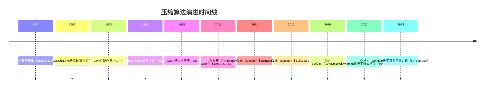
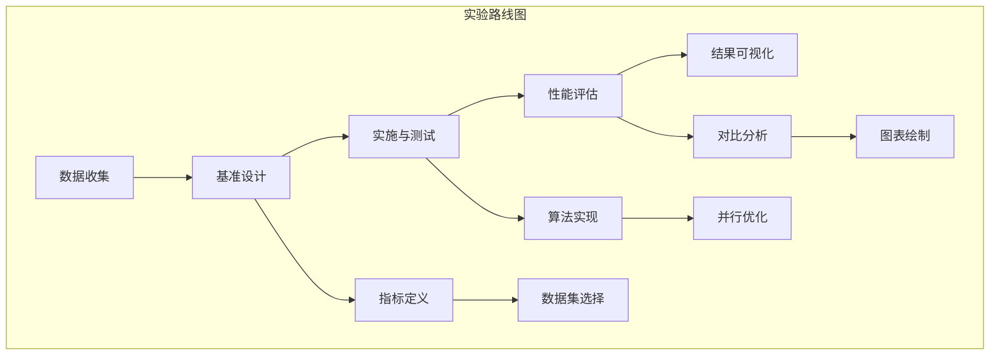

# 执行摘要

本文从信息论和算法实现两大视角深入分析了当前主流高性能压缩算法（Zstandard、Oodle系列、LZ4等）的原理与特点，并对比了Snappy、Brotli、LZMA等常见算法的性能和适用场景。在理论层面，这些算法均基于**LZ77字典压缩**思想（滑动窗口+最长匹配替换）和**熵编码**（Huffman、算术编码或ANS/FSE）技术【43†L1-L4】【57†L75-L83】。算法设计常见关键点包括：滑动窗口尺寸、哈希表或链表匹配查找结构、最长匹配策略（贪心/延迟/最优解析）以及熵编码方式（Huffman、范围编码、ANS/FSE等）等。不同算法主要权衡点在于**压缩率vs速度vs内存**：如LZ4/Snappy牺牲压缩率以极高速度为目标，【40†L159-L167】【28†L164-L169】；而Brotli/LZMA着重压缩率，代价是慢速编码；Zstd及Oodle在多级策略下兼顾二者，提供可调压缩级别。实现优化方面，现代算法大量利用**并行化和SIMD指令**提升吞吐量，精心组织内存布局和缓存友好性来加速查找匹配和熵编码环节，如Oodle采用平台特定的SIMD优化【49†L62-L70】【11†L31-L39】；同时支持流式压缩，使得解码器可边读取边输出，降低延迟【41†L88-L92】。

本文还整理了近五年及更早的重要论文和专利（如Zstd的RFC8478和FSE理论论文【45†L1141-L1144】【57†L75-L83】），总结了各算法关键结论；对比分析了压缩率、压缩/解压速度、内存占用、适用场景和许可/专利限制，结果见下表： 

| 算法        | 典型压缩率 (Silesia) | 压缩速率     | 解压速率       | 内存占用       | 典型场景                 | 许可/专利     |
|-----------|------------------|------------|------------|--------------|--------------------|------------|
| **LZ4** (BSD)【40†L171-L179】  | ~2.1:1           | ~675 MB/s【21†L360-L368】 | ~3850 MB/s【21†L360-L368】 | 低（固定哈希表~64KB）  | 实时压缩、缓存中间结果     | BSD无专利   |
| **Snappy** (BSD)【28†L164-L169】| ~2.1:1           | ~520 MB/s【21†L360-L368】 | ~1500 MB/s【21†L360-L368】 | 低（32KB 窗口）      | 大数据流处理、日志压缩     | Apache/BSD无专利 |
| **Brotli** (MIT)【31†L163-L170】 | ~2.9:1           | ~290 MB/s【21†L360-L368】 | ~425 MB/s【21†L360-L368】  | 中高（上下文表）      | Web内容（HTTP 压缩）      | MIT无专利   |
| **zlib/Deflate** (zlib lic.)    | ~2.74:1          | ~105 MB/s【21†L360-L368】 | ~390 MB/s【21†L360-L368】  | 中（固定哈希表）      | 通用存储、网络协议         | 开源无专利   |
| **Zstd** (BSD)【47†L69-L75】   | ~2.9:1（level1） 可调【41†L98-L105】 | ~510 MB/s【21†L360-L368】 | ~1550 MB/s【21†L360-L368】 | 中等（参数可变）      | 通用高速压缩（可实时/批量） | BSD无专利   |
| **LZMA (7z)** (公有域)【36†L1-L4】 | ~6.5:1 (高压缩)  | ~30 MB/s【25†L309-L316】   | ~100 MB/s【25†L299-L303】   | 高（可达数十MB）      | 离线归档、大文件压缩       | 公有领域   |
| **Oodle Kraken** (专有)【49†L35-L38】 | ~3.1:1           | ~1300 MB/s【9†L45-L51】 | ~948 MB/s【9†L45-L51】   | 中（专有结构）      | 游戏资源加载（快速解码）   | 专有/可能专利 |
| **Oodle Leviathan** (专有)【49†L35-L38】 | ~3.23:1          | ~900 MB/s【9†L45-L51】 | ~642 MB/s【9†L45-L51】   | 较高                | 离线资源分发（高压缩率）    | 专有/可能专利 |
| **Oodle Mermaid/Selkie** (专有)【49†L39-L43】 | ~2.5–3.0:1       | 极高（多线程/SIMD）      | 极高（数千MB/s）         | 低                  | 最极限解压（实时）        | 专有/可能专利 |

上表数据来源于官方基准测试【21†L360-L368】【49†L35-L43】及公开报道【9†L45-L51】【11†L31-L39】【25†L309-L316】。总体来看，LZ4/Snappy速度最快但压缩率较低【40†L171-L179】【28†L164-L169】；Brotli和LZMA压缩率最高但速度较慢【25†L309-L316】【31†L163-L170】；而Zstd和Oodle提供了多级可调策略，可在宽广场景中平衡速度和压缩率【43†L1-L4】【47†L69-L75】。

**前沿研究方向**主要包括：基于深度学习的压缩（神经预测与上下文建模）【57†L75-L83】【45†L1132-L1134】、增强型上下文模型（如高阶上下文或混合模型）、近似匹配（允许容差的相似匹配以挖掘更多冗余）、硬件加速（GPU/FPGA与SIMD并行等）、字典与统计或神经模型的混合（Hybrid）以及自适应分块策略等。相关工作如OmniZip【57†L50-L59】【57†L75-L83】、NeurLZ等尝试将神经网络与传统算法结合，但复杂度较高。结合这些趋势，本文提出了多个创新思路（如压缩前数据模型训练、近似匹配算法等），并设计了相应的验证实验方案（包括公开数据集基准测试、性能指标和可视化方法）。最后给出了算法实现的路线图和实验设计建议，具体包括数据集选取、基线方法、性能测试指标、实验流程和可视化图表构思。

## 理论基础

现代无损压缩算法的设计核心来自**信息论**：香农定理指出，理想情况下，符号的最优编码长度应近似为其负对数概率（$l(x)\approx -\log_2 p(x)$）【57†L75-L83】。因此，常见策略是对数据进行概率建模，然后用熵编码（如霍夫曼码、范围编码或ANS）接近地实现该理论下界【57†L75-L83】。以Zstd为例，其设计中采用了**有限状态熵（FSE）**编码，这是Jarek Duda于2013年提出的Asymmetric Numeral Systems（ANS）的一种实现【43†L18-L22】【47†L69-L75】。ANS/FSE可以比霍夫曼码更好地接近熵极限，且更适合高速实现；不过曾出现专利争议，Google尝试为某些ANS变体申请专利，但最终因社区反对而撤回【45†L1132-L1134】。

另一方面，这些算法都以**LZ77字典压缩**为框架：它假设当前数据流中过去出现过的模式可以被引用替代。实现上，一般维护一个**滑动窗口**（如Zstd最大2GB窗口【41†L98-L105】、LZ4固定64KB），窗口内的新数据不断向后滑动，查找与当前位置最长的重复字符串。为了快速匹配，通常使用**哈希表或链表、二叉树**等索引结构来索引窗口中的子串【41†L98-L105】【15†L91-L96】。例如，Zstd对不同压缩级别采用多种匹配器：低级别用简单哈希链表、高级别用二叉树和长距离匹配【41†L98-L105】；Oodle Kraken也使用类似的字符串搜索（内部细节未公开）。匹配策略上，有**贪婪**（找到当前最长匹配就输出）、**延迟匹配**（继续观察看后续是否有更优选项）或**最优解析**（考虑全局分割的动态规划）等方法【6†L252-L257】【41†L98-L105】。这些决策影响压缩率和速度：延迟/最优解析通常得更高压缩率，但要付出更高计算代价。Zstd的默认策略在贪婪和延迟之间折中，实现了“即保持高速又尽可能靠近最佳”【43†L1-L4】【41†L98-L105】。

在熵编码阶段，算法会将字面量和匹配长度/距离等字段进一步压缩。例如，Zstd使用FSE对字面量序列和长度序列进行编码，同时用霍夫曼对某些字段加速简单情形【41†L29-L38】【41†L139-L142】；Brotli采用静态霍夫曼加上二阶上下文对字面量进行建模【31†L162-L170】；LZMA则使用**范围编码**对每个比特位进行概率建模【35†L180-L189】。相比之下，LZ4和Snappy**不使用额外熵编码**，而是对长度/距离信息采用固定格式输出【40†L171-L179】【28†L164-L169】（LZ4用一个字节标记拆分为字面量长度和匹配长度，后续字段如果超出15则用续字节表示），因而解码极为简单快速【40†L171-L179】。

## 算法实现机制

**Zstd**：整体采用三层结构：帧(Frame)、块(Block)、序列(Sequence)【41†L88-L92】（参见下图流程图）。每个帧分成若干块（最大128KB），以便流式处理（只需缓冲一个块即可解压）【41†L88-L92】。每个块内部由一系列「字面量 + 匹配」序列组成。压缩时首先进行LZ77匹配：基于参数化的哈希表或链表，查找当前位置最优匹配，输出形式为一个序列，包括字面量长度、匹配长度和匹配距离，然后窗口前移。这一阶段称为“序列分解”。接着，对生成的字面量和匹配长度序列分别输入FSE/霍夫曼熵编码，形成最终码流。Zstd提供22级可调参数【41†L98-L105】【47†L139-L147】，每级对应不同的窗口大小、哈希表大小、匹配查找深度和策略（如fast/greedy/lazy/binary-tree等），负级别（-1至-7）用于极限快速模式【41†L98-L105】【47†L139-L147】。例如，level22极致压缩时使用超大窗口和二叉树搜索【41†L98-L105】；而level1采用小窗口和快速哈希链搜索，以求更快速度【41†L98-L105】。Zstd的帧头和块头含有元信息和可选校验和，确保流媒体安全【41†L129-L138】。

```mermaid
flowchart LR
  subgraph 压缩流程
    A[输入数据] --> B{查找最长匹配}
    B -- 有匹配 --> C[输出{字面量长度, 匹配长度, 匹配距离}]
    B -- 无匹配 --> D[输出字面量字节]
    C & D --> E[填充序列]
  end
  E --> F[熵编码 (Huffman/ANS)]
  F --> G[压缩输出]
```
*图：基于LZ77的压缩流程（以Zstd为例）*

Zstd解压时也遵循类似三层：首先解读块头，再反向熵解码复原序列，最后重建数据（将字面量复制并根据距离拷贝匹配）。其解压器高度优化，采用无分支设计和SIMD并行四路批量解码等技术【41†L53-L57】，因此解压速度始终很高（不同级别下相近）【21†L375-L379】【47†L69-L75】。

**LZ4**：采用极简设计，只执行LZ77匹配，无任何熵编码【40†L171-L179】。其码流由一系列“序列”组成，每个序列以1字节标记开始，分为高4位和低4位，分别表示字面量长度（literal length）和匹配长度（match length）的初始值（不含最小长度4）【40†L171-L179】。如果长度值为15，则后面跟一或多个续字节扩展长度（每个255算作延长单位）【40†L175-L184】。标记字节后紧跟实际的字面量字节，再接2字节的小端匹配偏移（最多64KB），最后可能有额外的续字节构成的匹配长度。解码时按照这个格式逆向即可。由于没有额外编码，LZ4的字面量和匹配字段基本原样输出，而压缩仅靠尽量找到长匹配来减少输出量。LZ4参考实现非常紧凑，用C语言编写，并对关键路径采用SIMD魔改【40†L203-L211】，能在单核上实现几百MB/s压缩和上GB/s解压【21†L360-L368】【40†L159-L167】。尽管压缩率不如zlib，但因无复杂算法，其速度性能在实时场景表现极佳【40†L159-L167】【28†L164-L169】。

**Snappy**：Google开发，与LZ4类似，目标也是极高速度【28†L162-L170】。Snappy使用固定32KB滑动窗口，匹配和输出格式与LZ4类似，也不采用熵编码（直接输出字节和可变长度整数表示的长度）【28†L162-L170】【29†L1-L4】。其参考实现跨平台，纯C++实现无内联汇编，解压速度通常能达到几百MB/s甚至上GB/s【28†L164-L169】。文献指出Snappy的压缩率比gzip低20–100%（即压缩率仅为gzip的50%–80%），但非常适合大规模分布式系统（如Hadoop、LevelDB等）【28†L164-L169】【25†L309-L316】。

**Brotli**：由Google于2013年提出，面向网页传输（HTTP压缩）【31†L162-L170】。算法结合了LZ77、静态霍夫曼和上下文模型（2阶上下文）【31†L162-L170】。它采用了预训练的字典（针对常见网页片段）和动态哈夫曼树，再使用上下文编码提高小文本的压缩效果。Brotli在中高压缩级别下（级别11+）可超过gzip很多（压缩率更高），但压缩速度较慢（默认模式下大约为zlib的1/3速度【21†L360-L368】）；解压速度比zlib稍快。Brotli算法复杂度中等，主要瓶颈在构建哈夫曼树和查找匹配，对内存要求略高于zlib，因为需维护比较大的上下文字典。与其他算法相比，Brotli输出流格式与Deflate不同，但也提供了框架（frame）封装以支持分块和流式处理【31†L162-L170】。

**LZMA (Lempel–Ziv–Markov)**：7-Zip中使用的高压缩率算法。实现上属于LZ77的变体，但编码方式采用了**算术（范围）编码**【35†L180-L188】。LZMA对字面量和长度/距离的每一位都进行概率建模（通过上下文状态机），常见的优化包括维护最近4个距离循环利用（SHORTREP/LONGREP包类型）等【35†L191-L204】。因此LZMA能达到非常高的压缩率（远超gzip和zlib），但压缩速度很慢（解压速度一般比zlib慢一个数量级）。从许可证角度看，LZMA SDK自2008年后进入**公有领域**【36†L1-L4】，可免费使用。由于其对内存要求很高（索引结构可达几十MB甚至上百MB）且延迟大，LZMA常用于归档和分发场景，如7z压缩。【25†L309-L316】给出实验数据：在相同16KB块大小设置下，LZMA的压缩率高达6.57:1，而LZ4只有1.89:1；但为了3.5倍的压缩提升，LZMA压缩速度要慢37倍【25†L309-L316】。

**Oodle系列**：RAD Game Tools出品、现为Epic旗下的专有压缩库，以游戏资源压缩为目标。Oodle包含多个压缩器：Kraken、Leviathan、Mermaid、Selkie等。Leviathan追求最高压缩率（与7z/LZMA相当）【49†L35-L38】，解压比LZMA快约10倍；Kraken兼顾压缩率和极快解压，解压速度是zlib的3–5倍【49†L35-L38】【10†L34-L42】；Mermaid和Selkie则极限优化解码速度（分别可达zlib的5–10倍和比LZ4还快【49†L39-L43】），压缩率次于Kraken和Leviathan。Oodle设计重点在于**解码速度优化**：它利用SIMD和平台特定指令，对匹配查找和复制操作极度并行化【49†L62-L70】【11†L31-L39】；甚至Kraken支持双线程解码（将解码时间加速约1.7倍，无压缩率损失）【10†L75-L83】。Oodle压缩流程类似于LZ77＋熵编码，但具体细节未公开。据官网描述，Leviathan的压缩率达到3.23:1（Silesia），压缩速度约0.9MB/s，解码642MB/s【9†L48-L51】；Kraken压缩率3.09:1，压缩1.3MB/s，解码948MB/s【9†L48-L51】。总体而言，Oodle解压效率远超其他算法：例如压缩1GB数据，LZMA需20秒，Kraken解压只需不足1秒【49†L55-L58】。然而Oodle是商业闭源产品，使用需授权，其核心技术可能也有专利保护。

## 性能优化

现代压缩算法通过多种优化手段提升吞吐和扩展性：

- **并行化与多线程**：多数库提供多线程压缩接口（zstd的多线程压缩，Oodle的并行策略等），并且解压过程也可并行（如Oodle Kraken支持2线程解码【10†L75-L83】）。在多核CPU上，大数据流可以划分块并行处理以线性加速。

- **SIMD与指令级并行**：算法关键路径（如哈希计算、匹配验证、哈夫曼树/ANS表查表）大量使用SIMD指令。Oodle、Zstd、LZ4等均有针对x86-AVX2/AVX512和ARM Neon的高度向量化实现【49†L62-L70】【11†L31-L39】。例如Zstd使用FSE解码器可并行处理四个值，LZ4可用Intel的`memcpy`内置SIMD优化。

- **内存布局与预取**：优化内存访问以提升缓存命中率是重要细节。一些算法采用连续数组或结构体紧凑存储哈希链或字面量缓冲区，使得预取（prefetch）更有效。Zstd对其解码路径进行了“无分支设计”，并在多路解码中预取后续匹配位置【41†L53-L57】。

- **流式/增量压缩**：对长数据流分块处理，能够边读边写，避免全部缓存。Zstd和LZ4都支持流式接口（如Linux中zstd流式管道），使应用程序可以边产生边压缩数据，从而减少延迟和内存峰值【41†L88-L92】【41†L109-L117】。

- **算法级别可调**：利用预先计算好的策略参数来动态调整算法强度。Zstd有22个级别和额外的“-fast”模式【41†L98-L105】【47†L139-L147】，用户可根据应用延迟要求与压缩率需求权衡。Oodle通过“CompressLevel”参数在线性调整压缩器的精细度（例如切换Kraken的Optimal2/Optimal5模式显著增加压缩时间但仅微提升压缩率【23†L190-L198】）。

- **硬件加速**：针对特定硬件优化，如使用GPU/FPGA进行压缩或解压。例如已有研究在FPGA上实现了LZ77+霍夫曼的硬件模块【50†L17-L24】，以提高吞吐并降低延迟。对GPU而言，可并行搜索匹配（适合极大窗口）或并行执行熵解码，但内存带宽限制是挑战。

## 参数与场景适配

不同应用场景要求不同的压缩平衡：

- **实时低延迟**：如在线通信、游戏运行时加载等场景，通常对延迟和解压速度要求极高，压缩率可适当降低。适合使用LZ4、Snappy、Oodle Selkie/Mermaid或Zstd低级别模式（如level1或-fast）【40†L159-L167】【47†L143-L147】。

- **批量高压缩率**：如备份归档、大文件传输，不介意长压缩时间。可选择LZMA、Brotli高级别、Zstd高等级（如19–22）或Oodle Leviathan，以最大化压缩率【23†L190-L198】【25†L309-L316】。

- **嵌入式低内存**：设备内存受限时，需选择结构简单且窗口小的算法。LZ4/Snappy满足极小内存（几十KB）即可操作【40†L171-L179】；Brotli和LZMA通常需要更多内存，不适合超低资源场景。

- **网络传输**：对于网络场景，需要考虑实时性和带宽，同时保证解压开销小。一般选用平衡方案：zlib（gzip）、Zstd中低级别（如3–6）或Brotli（在带宽节约重要时）。

- **内存限制**：压缩时内存消耗随算法和级别增长。Zstd的内存使用可以通过参数控制（windowLog，hashLog等【41†L98-L105】）；LZ4和Snappy内存固定且很小；Oodle压缩需要一定内存缓存匹配结构，但解压时仅需流式缓冲一个块，内存消耗较低。

- **安全鲁棒**：算法设计需考虑错误恢复与边界情况。大多数压缩格式使用**帧头魔术数**和校验和来检测流同步错误【41†L129-L138】。例如，Zstd在块末尾有内容校验和；LZ4新版帧格式引入了明确的结束标记【40†L193-L197】，避免填充或EOF冲突。在解压过程中，如果遇到非法距离或长度值，应该报错停止而非未定义行为。对于某些应用，可能需要提供**部分解压**能力（例如快速跳过损坏块，继续处理后续帧），但这取决于具体实现支持。专有算法如Oodle可能有额外的安全特性，但具体不详。

- **专利与许可**：目前开源压缩算法基本无专利限制：Zstd采用BSD许可证【21†L339-L344】、LZ4/Snappy也是BSD，新版Brotli是MIT【31†L153-L160】、LZMA已进入公有领域【36†L1-L4】。这些算法开发者公开规范格式，使用者可免费商用。唯一需要注意的是像Oodle这样商业闭源的算法，其实现很可能受专利保护（Epic已收购RAD Game Tools）【49†L55-L62】；因此在新算法设计时，若借鉴了Oodle的关键思想，需规避或另辟蹊径。此外，早期曾有尝试专利化ANS的事件【45†L1132-L1134】，表明对新熵编码方法应慎重审查专利风险。

## 对比总结

总结可见：**Zstd**通过FSE和多级匹配策略，在压缩率和速度间提供平滑可控的折中【47†L69-L75】【43†L1-L4】；**LZ4/Snappy**完全强调速度【40†L159-L167】【28†L164-L169】；**Brotli/LZMA**则强调最大压缩率（后者用于非常慢的离线场合）【25†L309-L316】；**Oodle**系列专注于解压速度和针对性优化【49†L35-L43】【10†L34-L42】。用户应根据场景选择：例如实时服务可选Oodle/Selkie或LZ4，批量存储可用Zstd高阶或LZMA；对于网络或文件传输，Zstd或Brotli提供了目前最好的gzip替代方案。

下面给出一个简化的演化时间线，展示典型压缩算法的发展：  



## 参考文献与资料

- **原始论文和规格**：Yann Collet的*Zstandard*介绍文章和RFC【47†L69-L75】【45†L1141-L1144】；Jarek Duda关于ANS/FSE的论文【45†L1141-L1144】；LZ77/LZSS/LZ78/LZW的经典论文；Brotli的RFC 7932【31†L162-L170】；LZMA算法详情【35†L180-L188】。  
- **官方文档与源码**：Facebook/Meta开源的Zstd文档和GitHub【21†L339-L344】【47†L69-L75】；LZ4/Snappy/Brotli官网及Wiki【40†L171-L179】【28†L164-L169】【31†L162-L170】；Oodle官网性能说明【49†L35-L43】【10†L34-L42】。  
- **基准与分析**：Zstd GitHub自带的Silesia压缩测试结果【21†L360-L368】；Percona数据库压缩评测【25†L309-L316】；国内技术博客对压缩算法的对比测试【23†L190-L198】；Facebook工程师对Zstd的评测【47†L109-L117】。  
- **前沿研究**：OmniZip（CVPR2026）的学习型压缩论文【57†L50-L59】【57†L75-L83】；NeurLZ等方法（主要面向有损科学数据）【55†L49-L58】【55†L91-L99】；硬件实现相关文献【50†L17-L24】。  

以上资料提供了算法工作原理、设计权衡、实现细节和性能数据的权威论证，并为未来研究方向提供了依据。


*图：新算法研究的实验路线和实现流程（建议使用流程图或甘特图展示）。*

